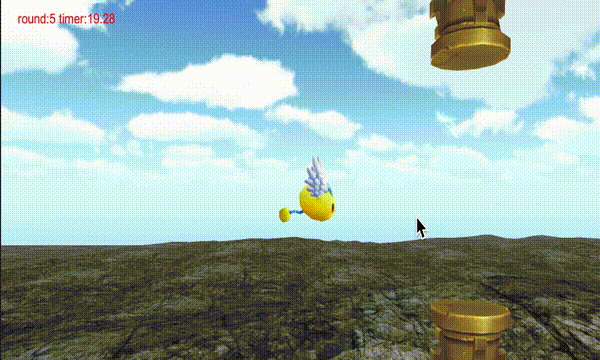

<br><br><br>><br><br>><br><br>

<b>强化学习 游戏AI Trainning的代码工程</b>


分为三个过程，对应到项目中都有不同的设置：

1.  <a href="https://huailiang.github.io/2018/03/19/reinforcement/">Unity 中应用Reinforcement-Q_Learning </a>

2.  <a href="https://huailiang.github.io/2018/03/20/reinforcement2/">外部环境(Python)实现游戏训练，Unity负责表现 </a>

3.  <a href="https://huailiang.github.io/2018/03/23/reinforcement3/">使用Deep Q Network 神经经网络训练游戏AI </a>

4.  <a href="https://huailiang.github.io/2018/11/10/ppo//">使用Policy Gradient & PPO神经经网络训练游戏AI </a>


## Shell

你可以查看此工程可以通过在ternimal输入下面命令：

```shell

git clone https://github.com/huailiang/bird

#切换到PolicyGradient
git checkout PolicyGradient

#切换到mulstate分支
git checkout mulstate

```


## Requirement

server:
- tensorflow==1.12.0
- matplotlib
- numpy>=1.11.0

client:
- unity >=2018.2.7
- <a href="https://s3.amazonaws.com/unity-agents/TFSharpPlugin.unitypackage">TFSharpPlugin</a>


## Mode

### 1. 手动操作试玩游戏

首先在unity中需要设置游戏模式为Player：


然后，需要开启柱子（障碍）选项，设置宏：ENABLE_PILLAR


游戏的玩法很简单：每点击一次屏幕，小鸟就拍打翅膀一次，从而获得一个升力。 否则的话，小鸟将不断下降。如果小鸟碰撞到地面或者柱子，就意味着游戏失败。通过不断闯关，飞行时间越长，得分也就越高。


### 2. python环境中训练

在unity中对GameManager(c#) 的模式设置为 External 


在python环境中environment(python) 需要把 Train 变量设置为 True


运行python中的main.py, 此时socket会建立起来，并开始监听来自unity侧的连接。unity启动后会自动尝试和python建立连接，连接成功之后，点击unity屏幕就开始train了。如果python启动后30S内没有收到来自unity的连接，会主动断开自身socket。

训练的过程中，不要点击屏幕，游戏失败后会自动的接着下一轮的循环。如果想结束训练，停掉unity的运行按钮即可。此时python收到unity发过来的结束消息，会把当前神经网络的session和参数进行固化（freeze），生成proto文件（ppo.bytes）并保存到python当前目录（models/ppo/）中。


### 3. 测试训练结果

设置跟训练环境一样，唯一不同的是需要把python的environment.py中的变量Train设置为False。

此时python环境会直接加载上个步骤中训练好的结果（ppo.bytes），并根据客户端发来的请求自动的做出决策。


### 4.Unity中测试训练结果

首先，你需要下载TFSharpPlugin这个插件，并且导入到Unity中。

其次，需要在unity中需要开启宏：TensorFlow


最后，你需要拷贝python中训练好的ppo.bytes到unity中，并且需要在unity中设置游戏模式设置为Internal, 并将ppo.bytes拖拽到graphModel


运行游戏，你就可以看到训练好的小鸟就可以不断闯关了。


## Contact

Email: peng_huailiang@qq.com

Blog:  https://huailiang.github.io
